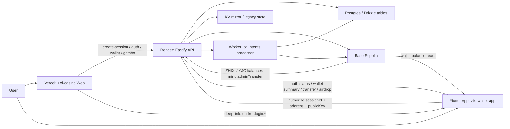
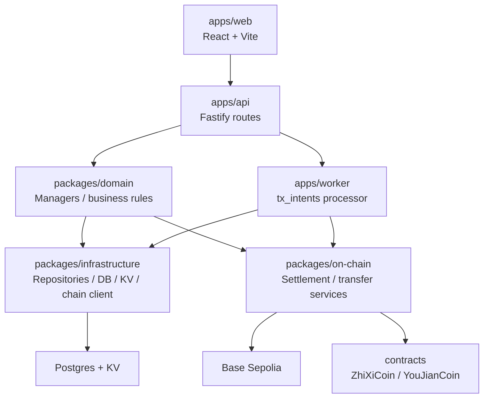
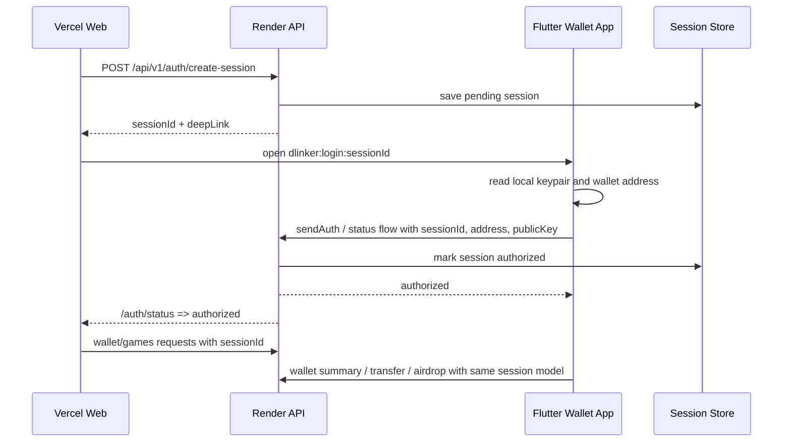

# Zixi 雙專案全景技術導覽與耦合分析

本文是 `zixi-casino` 與 `zixi-wallet-app` 的系統級導覽，目標讀者是接手工程師、架構審視者與需要快速掌握全系統資料流的人。重點不只是功能清單，而是實際模組責任、跨專案關係、狀態來源、鏈上同步策略，以及哪些地方耦合最深、最容易牽一髮動全身。

## 1. 專案地圖

Zixi 目前不是單一產品，而是兩個邏輯上強連動、程式碼上分離的專案：

| 專案 | 主要責任 | 技術棧 | 部署/執行位置 |
| --- | --- | --- | --- |
| `zixi-casino/` | 賭場 Web、Fastify API、遊戲結算、物品與活動制度、管理後台、鏈上對接、背景 worker | React 18 + Vite、Fastify 4、pnpm workspace、TypeScript、Drizzle、Ethers/Viem | Web 在 Vercel，API 在 Render，worker 獨立執行 |
| `zixi-wallet-app/` | 使用者本地錢包 App、私鑰保管、deep link 授權、掃碼、轉帳、airdrop、餘額同步 | Flutter、Dart、web3dart、secure storage | 使用者裝置端，非雲端服務 |

兩個專案不能 cross-import，因為它們不是同一個 workspace，也不是同一個部署單元。`zixi-casino` 是雲端服務與 Web 體驗，`zixi-wallet-app` 是客戶端錢包。兩者只透過 HTTP API、sessionId、deep link 協議與同一組鏈上資產互相協作。

### 主要入口

- Casino Web 入口：`apps/web/src/main.tsx` -> `apps/web/src/App.tsx`
- Casino API 入口：`apps/api/src/index.ts`
- Casino Worker 入口：`apps/worker/src/index.ts`
- Wallet App 入口：`flutter_app/lib/main.dart`
- Web 部署設定：`vercel.json`
- API 部署設定：`render.yaml`

## 2. 系統總體架構



### 這張圖背後代表的事

- Web 與 App 都不是單獨可運作的產品，它們共同依賴同一個 API 與同一組地址/session 模型。
- API 同時管理三種狀態來源：
  - 鏈上真實餘額
  - DB 中的 wallet/ledger/intent 狀態
  - KV mirror 與 legacy 狀態
- Worker 並不是附屬功能，而是鏈上最終一致性的關鍵環節。很多業務流程先寫 DB/KV，再靠 `tx_intents` 由 worker 補到鏈上。

## 3. zixi-casino 內部分層

`zixi-casino` 是一個 monorepo，但不是單層 Web app，而是前端、API、domain、資料層、鏈上層、worker 與合約共同組成。



### 層級責任

- `apps/web`
  - 使用者看到的賭場、錢包、商店、活動、管理後台。
  - 主要透過 Axios + React Query 呼叫 Fastify API。
- `apps/api`
  - HTTP 邊界層。
  - 接住 session 驗證、body/query/header、回傳 envelope、調用 domain/service/repository。
- `packages/domain`
  - 主要業務規則所在。
  - 包含 `WalletManager`、`OnchainWalletManager`、`VipManager`、`RewardManager`、`ChestManager`、`GameManager`、`SettlementManager` 等。
- `packages/infrastructure`
  - 具體資料存取層。
  - 包含 Drizzle schema、repository、KV 操作、ChainClient。
- `packages/on-chain`
  - 更偏鏈上執行策略與 service abstraction。
  - 負責 settlement、transfer、鏈上查詢與封裝。
- `apps/worker`
  - 輪詢 `pending/failed` 的 `tx_intents`，將延後處理的資金動作補鏈。
- `contracts`
  - `ZhiXiCoin.sol` 與 `YouJianCoin.sol`，都實作 ERC-20 + owner 控制的 `mint` / `burn` / `adminTransfer`。

## 4. 前端 Web

### 路由與畫面結構

Web 根入口在 `App.tsx`，核心模式是：

- 未授權：顯示 `LoginView`
- 已授權但未建立個人資料：顯示 `ProfileSetup`
- 已授權：進入 `/app/*` 內的主應用

主要頁面包含：

- `/app`：`LobbyView`
- `/app/casino/lobby`：房間/遊戲入口
- `/app/casino/:game`：各遊戲頁
- `/app/wallet`：錢包總覽
- `/app/swap`：幣種轉換
- `/app/shop`：商店、購買 chest key、兌換與出售
- `/app/market`：市場模擬
- `/app/rewards`：獎勵與活動
- `/app/events`：campaign 活動
- `/app/inventory`：道具與箱子
- `/app/collection`：收藏
- `/app/transactions`：公開交易看板
- `/app/admin`：管理後台
- `/app/settings`：偏好設定
- `/app/info`：VIP、賠率、物品資訊

底部導航 `AppBottomNav` 固定導向：

- home
- casino
- market
- shop
- wallet
- settings

### 狀態管理

Web 前端的核心狀態來自三層：

- `useAuthStore`
  - sessionId、授權狀態、地址。
  - 使用 localStorage `auth-storage`。
- `useUserStore`
  - 使用者名稱、地址、頭像、稱號、餘額展示。
- React Query
  - 真正的遠端資料同步層。
  - `useSyncUser` 與 `useWallet` 會定期刷新使用者、錢包與鏈上資料。

`useFastLogin()` 會在載入時用 `sessionId` 打 `/api/v1/auth/me`，搭配 `custody_remember_me` 自動恢復 web session。這代表 Web 不是錢包真相來源，而是 session 驅動的前端。

### API 依賴型前端

幾個前端頁面其實是高耦合 API 殼：

- `LobbyView`
  - 依賴 inventory、market、announcements、transactions、leaderboard。
- `WalletView` / `useWallet`
  - 依賴 `/wallet/summary`、`/wallet/airdrop`、`/wallet/transfer`、`/wallet/convert`。
- `ShopView`
  - 同時拉 rewards catalog、wallet summary、inventory、market、chests。
- `AdminView`
  - 幾乎橫跨所有制度：黑名單、公告、reward catalog、submission、campaign、grant、ticket、ops、chain sync。
- 遊戲頁
  - 幾乎都是對應 `/api/v1/games/<game>/play` 的前端包裝。

### UI 與國際化

- 樣式基底：Tailwind，自訂色 `#fcc025`、背景 `#0e0e0e`
- 字體：`Manrope`
- i18n：`en` / `zh`，fallback `zh`
- 組件特徵：
  - `Layout`
  - `SoundPlayer`
  - `TransactionQueueIndicator`
  - `DanmakuOverlay`

這些 UI 組件不只是展示，它們直接反映後端的資料制度，例如音效偏好、交易佇列、彈幕事件。

## 5. API 後端

### Fastify 入口

`apps/api/src/index.ts` 負責：

- 建立 Fastify 實例
- 掛 `cors`、`compress`
- 掛 Zod validator/serializer
- 註冊所有 route module
- 提供 `/health`、`/api/diag`、`/api/diag-thumb`
- 統一 error handler

支援的前端來源包含：

- `https://zixi-casino.vercel.app`
- `https://device-linker-api.vercel.app`
- `http://localhost:5173`
- `https://zixi-casino-api.onrender.com`

### 回應格式

API 主要使用統一 envelope：

```json
{
  "success": true,
  "data": {},
  "error": null,
  "requestId": "req-id",
  "timestamp": 1710000000000
}
```

這個 envelope 是 Web 與 App 的共同契約，因此屬於跨專案 interface。

### 授權模型

不是 JWT，而是 session-based auth：

- `sessionId` 可從 `x-session-id` header、query、body 傳入
- session 需在 `sessions` 表中存在且狀態為 `authorized`
- admin 權限依 session 對應的 address 是否等於 `ADMIN_ADDRESS`

這讓 Web 與 App 共用一個授權基礎，但也讓所有依賴 session 的 API 都對 `sessions` 表與 session lifecycle 高耦合。

### 路由分群

主要分群如下：

- `auth`
  - create-session
  - status
  - custody register/login
  - me
- `wallet`
  - summary
  - airdrop
  - transfer
  - withdrawals
  - convert / convert/yjc-to-zxc
- `games`
  - 12 個遊戲專用 route + rooms + generic play
- `market`
  - snapshot / me / action
- `rewards`
  - catalog / me / submissions / equip / campaigns claim
- `chests` / `inventory`
  - 箱子、開箱、狀態、使用道具
- `admin`
  - 維運、黑名單、調餘額、catalog、campaign、grant、ticket、ops、chain sync
- `support`
  - 公告、工單、聊天室
- `profile`
  - username、sound prefs、一般偏好
- `leaderboard` / `vip` / `stats` / `dashboard`

### 管理端能力

管理端並不是獨立服務，而是同一套 API 上的 admin route。它直接操控：

- 維護模式
- 黑名單
- 公告
- 調整 ZXC/YJC 餘額
- reward catalog
- campaign
- submission 審核
- grant tokens/items/avatars/titles
- ticket 管理
- ops event 檢視
- chain sync 狀態

這代表管理端和核心業務資料完全共域，優點是快，缺點是任何 schema 或行為變更都很容易同時影響玩家流程與後台流程。

## 6. Domain / Infrastructure / On-chain

### Domain managers

核心 manager 及責任：

- `IdentityManager`
  - 建立 pending session
  - 生成 deep link / legacy deep link
- `AuthManager`
  - custody login / register
- `WalletManager`
  - 建立 `tx_intents`
  - 建立 bet/payout settlement intents
  - 建 summary
- `OnchainWalletManager`
  - 解析 RPC / contract / admin wallet runtime
  - 處理 ZXC<->YJC 換算
- `GameManager`
  - 各遊戲隨機與 payout 規則
- `SettlementManager`
  - 遊戲結算抽象
- `OnchainSettlementManager`
  - 將結算導向鏈上流程
- `VipManager`
  - VIP level、下注上限、費率折扣
- `RewardManager`
  - 條件解鎖稱號
- `ChestManager`
  - 掉落、權重、pity、庫存更新
- `MarketManager`
  - 模擬市場帳戶與快照計算
- `SupportManager`
  - 工單/客服業務規則

### Infrastructure

`packages/infrastructure/src/db/schema.ts` 定義整體資料模型，重要資料群如下：

- 身份與 session
  - `users`
  - `custody_accounts`
  - `custody_users`（legacy）
  - `sessions`
- 使用者展示與物品
  - `user_profiles`
- 錢包與交易
  - `wallet_accounts`
  - `wallet_ledger_entries`
  - `wallet_balance_snapshots`
  - `tx_intents`
  - `tx_attempts`
  - `tx_receipts`
- 遊戲
  - `game_sessions`
  - `game_rounds`
  - `game_actions`
  - `game_settlements`
- 獎勵與活動
  - `reward_catalog`
  - `reward_campaigns`
  - `reward_grants`
  - `reward_submissions`
- 市場
  - `market_accounts`
  - `market_trades`
- 公告與客服
  - `announcements`
  - `support_tickets`
- 維運
  - `ops_events`
  - `admin_actions`
  - `system_config`
  - `kv_store`

### On-chain 層

`packages/on-chain` 與 `OnchainWalletManager` 一起構成鏈上整合層。

它處理：

- contract address 與 RPC runtime
- treasury / loss pool
- admin wallet 代理轉帳
- 結算服務
- 鏈上查餘額
- 交易結果與 receipt 整理

這層不是單純 SDK，因為它深度知道業務語意，例如 bet、payout、admin_credit、conversion。

## 7. Worker 與最終一致性

Worker 的責任是把非同步資金動作從 DB/intent 狀態補到鏈上。

### 運作方式

- 定期讀取 `pending` 與可重試的 `failed` intents
- 依 intent 類型推導：
  - from address
  - to address
  - token contract
  - amount
- 呼叫鏈上 transfer / mint
- 更新 intent 狀態為 confirmed 或 failed
- 記錄 ops event

### Worker 為什麼重要

許多操作不會在當下直接上鏈：

- 某些遊戲結算在 async 模式下只先建立 `bet/payout intents`
- airdrop fallback 可直接加 DB/KV 餘額，再建立 `admin_credit`
- admin adjust-balance / grant token
- 某些 chest/shop 補償或直接記帳型流程

因此：

- DB 與 KV 可以先變
- 鏈上稍後再補
- worker 是達成最終一致性的必要元件

如果 worker 掛掉，系統仍可暫時「看起來能用」，但帳務會逐漸與鏈上脫鉤。

## 8. Wallet App

Wallet App 不是純 UI，它同時扮演：

- 本地私鑰保管者
- Web session 授權器
- 鏈上餘額讀取端
- 轉帳發起端
- airdrop 領取端

### App 的核心能力

- 產生 secp256k1 私鑰
- 以 `flutter_secure_storage` 儲存，必要時 fallback 到 `SharedPreferences`
- 從公鑰推導 EVM address
- 對指定資料做 ECDSA 簽名
- 解析 `dlinker:login:*` 與 `dlinker:coinflip:*`
- 用 `sessionId` 連回 API 做授權
- 每 15 秒同步餘額
- 顯示通知
- 掃碼、選聯絡人、手動輸入地址
- 跳轉到賭場網站

### 支援資產

`AppToken.supported` 內建兩種鏈上資產：

- `zhixi`
  - symbol: `ZHIXI`
  - address: `0xe3d9af5f15857cb01e0614fa281fcc3256f62050`
- `yjc`
  - symbol: `YJC`
  - address: `0x82D6aDB17d58820324D86B378775350D03a071AE`

API base URL 直接寫在 App 內：

- `https://zixi-casino-api.onrender.com/api/`

這是高耦合設計，因為 App 發版與後端 endpoint 直接綁死。

### App 授權與錢包流程



### App 與 Web 的關係

- Web 不保管私鑰
- App 不負責完整賭場體驗
- session 是兩者的橋
- address/publicKey 是同一個身份憑證

這條鏈是全系統最高耦合之一，因為牽涉 Web UX、App deep link、session 表、API auth 與錢包地址一致性。

## 9. 遊戲制度

### 現有遊戲

目前前後端皆有明確實作的遊戲包括：

- Roulette
- Horse Racing
- Slots
- Coinflip
- Sicbo
- Bingo
- Duel
- Blackjack
- Dragon Tiger / Shoot Dragon Gate
- Poker
- Bluff Dice
- Crash

### 共用遊戲框架

雖然每個 route 分開，但結構非常一致：

1. 驗證 session 與玩家身份
2. 驗證下注額與 token
3. 檢查 VIP max bet
4. 讀取可玩餘額
5. 扣除 bet
6. 用 `GameManager` 決定結果與 multiplier
7. 走 `gameSettlement` 做結算
8. 寫 round、ledger、ops event、history
9. 更新 total bet / total win，必要時解鎖稱號

### 結算骨幹

`apps/api/src/utils/game-settlement.ts` 是遊戲資金流程的真正中樞，處理：

- balance source 優先順序
- bet 扣款
- async/sync settlement 模式
- on-chain runtime 檢查
- `tx_intents` 建立
- prevent-loss buff 消耗/回補
- total bet / total win 累積
- auto unlock titles

### VIP 制度

Zixi 有兩套並行的 VIP 系統：

#### A. 會員等級（Level Tier — 32 級）

基於 `totalBet * 0.7 + YJC 持有 * 0.3` 計算分數，決定等級。

| 等級範圍 | 門檻（分數） | 最高單注 | 每日加成 | 費率折扣 |
|---------|------------|---------|---------|---------|
| 普通會員 (1) | 0 | 1,000 ZXC | ×1.0 | 0% |
| 青銅會員 (2) | 10,000 | 5,000 ZXC | ×1.1 | 0% |
| 白銀會員 (3) | 100,000 | 10,000 ZXC | ×1.2 | 0% |
| 黃金會員 (4) | 1,000,000 | 50,000 ZXC | ×1.3 | 20% |
| 鑽石等級 (6) | 50,000,000 | 200,000 ZXC | ×1.5 | 50% |
| 創世等級 (16) | 100,000,000,000 | 1,000,000,000 ZXC | ×3.0 | 100% |

- 滿 32 級最高「神諭十二階」，門檻 10,000,000,000,000,000 分
- 費率折扣影響遊戲結算時的平台抽成（base 2%）
- 達到門檻時自動解鎖對應 `title_member_N` 稱號
- 會員稱號不會從寶箱中掉落

#### B. YJC VIP 等級（YJC VIP Tier — 3 級）

基於 YJC 持有量或購買 VIP 通行證：

| 等級 | YJC 持有 | 特權 |
|------|---------|------|
| 未達 VIP | 0 YJC | 無 |
| VIP 1 | ≥ 1 YJC | 進入 table_1 高額桌 |
| VIP 2 | ≥ 1,000 YJC | 進入 table_1/table_2 + 零手續費 |

**VIP 通行證（vip_pass / vip2_pass）：**
- 可在商城購買，直接賦予對應 VIP 資格（不看 YJC 持有）
- 購買後在 `user_profiles.active_buffs` 寫入永久 buff 記錄
- 僅限購買一次，不可重複
- VIP 通行證賦予的資格與 YJC 持有 VIP 等效

#### C. 對遊戲的影響

- `VipManager.getVipLevel(address)` 決定玩家的 maxBet（最高單注金額）
- `VipManager.getBetLevelFeeDiscount(address)` 決定費率折扣
- 結算時：`fee = betAmount * 2% * (1 - discountRate)`
- VIP 2（零手續費）：`hasVip2(address)` 返回 true 時 fee = 0

#### D. 實作結構

- 等級定義：`packages/shared/src/constants.ts`（LEVEL_TIERS, YJC_VIP_TIERS）
- 核心邏輯：`packages/domain/src/levels/vip-manager.ts`（VipManager）
- 費率計算：`packages/on-chain/src/services/VipBetLevelService.ts`
- API：`apps/api/src/routes/v1/vip.ts`（GET /me, /levels, /:address）
- 前端：`apps/web/src/features/info/tabs/VIPTab.tsx`（等級 + VIP 兩分頁）
- 通行證購買：`apps/api/src/routes/v1/inventory.ts`（/buy）

### 防輸 buff

若玩家有 `prevent_loss` buff：

- 輸的那局可能直接改成退回 bet
- async 結算失敗時還需要把 buff 回補

這使得遊戲結算不只是金額加減，而是跨 inventory、rewards、chain queue 的複合流程。

## 10. 物品、Chest、獎勵與活動制度

### Chest 稀有度與價格

`CHEST_CONFIGS` 定義五種 chest：

- common
- rare
- epic
- legendary
- mythic

每種 chest 具備：

- price
- guaranteed rarity
- pityThreshold
- dropCount min/max
- rarity weights

### 掉落類型

`ITEM_DROP_TABLES` 中物品分為：

- `token`
  - ZXC 為主，部分高稀有度包含 YJC 碎片或 YJC
- `buff`
  - xp_boost
  - luck_boost
  - prevent_loss
  - vip_trial
- `avatar`
- `title`
- `collectible`

### 開箱邏輯

`ChestManager.openChest()` 處理：

- 依 chest 類型與權重決定稀有度
- pity 是否觸發保底
- 依 rarity table 抽 item
- 更新 inventory / avatars / titles
- 計算 totalValue

### Inventory 狀態模型

`user_profiles` 內的相關欄位：

- `inventory`
  - itemId -> quantity
- `ownedAvatars`
- `ownedTitles`
- `activeBuffs`
- `selectedAvatarId`
- `selectedTitleId`

重點 quirks：

- `keyCounts` API 用 chest type ID 當 key，例如 `common`、`rare`
- `chest_key_` 前綴只存在內部 inventory map
- 裝備 avatar/title 後，inventory 內可能歸零或移除，但 API 會 backfill 讓前端仍看得到
- collectibles 重複時可補償 ZXC

### 兩套稱號系統

稱號不是單一路徑生成，而是兩套來源：

1. 掉落型稱號
   - 來源：`ITEM_DROP_TABLES`
   - 透過 chest / inventory 取得
2. 條件解鎖型稱號
   - 來源：`RewardManager.checkTitleUnlock()`
   - 依 `totalBet`、`totalWin`、member tier 解鎖

兩者最後在 `/api/v1/rewards/catalog` 合流供前端展示。這是典型的「業務意義接近，但資料來源不同」的設計。

### Campaign / Grant / Shop / Gift / Pawn

- `reward_campaigns`
  - 活動定義
  - 支援 claim 限制、時窗、等級門檻、獎勵包
- `reward_grants`
  - admin 或 campaign 實際發放紀錄
- `reward_catalog`
  - 管理端可維護的 catalog，與掉落表是另一個系統
- shop
  - 買 chest key、買 catalog 物件、做幣種轉換
- gift
  - 使用者互送
- pawn
  - 出售物品或相關變現

這些功能最後都會回到同一份玩家狀態：錢包、inventory、owned titles/avatars、ledger、grant log。

## 11. 幣與上鏈制度

### 幣種

系統同時處理兩種資產：

- `ZXC` / `ZHIXI`
  - 賭場主幣
  - 大部分獎勵、下注、補償、airdrop 以它為核心
- `YJC`
  - 次級或高價值資產
  - 可由 ZXC 轉換而來，也可在高稀有 chest 中取得部分單位

### 合約能力

兩份合約 `ZhiXiCoin.sol` 與 `YouJianCoin.sol` 都有：

- `mint(address to, uint256 amount)`
- `burn(address from, uint256 amount)`
- `adminTransfer(address from, address to, uint256 amount)`

這代表 owner 可以直接在不依賴 allowance 的情況下做管理型轉帳。對營運流程很方便，但也讓後端與合約 owner 權限緊耦合。

### 幣種轉換

轉換比率固定：

- `1 YJC = 100,000,000 ZXC`

轉換路徑：

- `POST /wallet/convert`
  - ZXC -> YJC
- `POST /wallet/convert/yjc-to-zxc`
  - YJC -> ZXC

實際流程不是單一交易，而是兩步：

1. 從使用者地址把來源幣種轉到 treasury
2. `mint` 目標幣種到使用者地址

因此 conversion 會產生兩個 intents、兩次鏈上動作、兩筆 ledger，且存在「第一步成功、第二步失敗」的對帳風險。

### 三種狀態來源

這個系統必須明確區分三種餘額真相來源：

1. 鏈上真實餘額
   - 最終真相
   - 由 `ChainClient` / contract 查詢
2. DB wallet / ledger
   - 服務端查詢、交易紀錄、管理後台、歷史統計依賴它
3. KV mirror / legacy
   - 舊流程殘留與 fallback mirror

`gameSettlement.getBalance()` 與 `wallet summary` 都有在做這三層的解決與回填。這是目前系統最容易讓新接手者誤判的地方。

## 12. 部署拓樸

### Web on Vercel

`vercel.json` 指向：

- build: `pnpm build:web`
- output: `apps/web/dist`
- rewrite: 全部回 `index.html`

這表示 Vercel 只託管 SPA 靜態資產，不承擔 API 邏輯。

### API on Render

`render.yaml` 顯示：

- Node web service
- 啟動 `apps/api/dist/index.js`
- build 時會把 shared / infrastructure / on-chain / domain / api / web 都建起來

這是「單 API 服務負責整個 server-side business layer」的部署方式。

### Worker

worker 目前是獨立進程模型，不在 Vercel 上，也不是 Web service 的附屬 thread。它需要能持續存活地輪詢 intents。

### Chain

鏈上目標是 Base Sepolia，對兩個專案都重要：

- Casino API 需要它做餘額讀取、transfer、mint、settlement、conversion
- Wallet App 也以同一組 token address 顯示資產與操作

## 13. 耦合分析

### 高耦合

#### 1. `wallet/auth/session <-> web <-> app <-> chain`

原因：

- Web session 是登入入口
- App deep link 是授權橋樑
- address/publicKey 是跨端身份
- API session 表是共同真相
- 餘額又依賴鏈上與 DB/KV 補寫

風險：

- deep link 協議變更會同時影響 Web 與 App
- session 狀態判定異常會讓兩端同時失效
- address/publicKey 不一致時會變成疑難雜症

#### 2. `game settlement <-> tx_intents <-> worker <-> balances`

原因：

- 遊戲不只是算結果，還會動到餘額、ledger、鏈上 intent、title unlock、buff rollback
- async 模式下，使用者看到的結果與鏈上最終落帳有時間差

風險：

- worker 故障造成帳務延遲或鏈上不同步
- intent 部分失敗時需要額外 reconciliation
- DB/KV 已更新但鏈上未完成時，前台顯示可能短暫失真

#### 3. `inventory/rewards/admin/catalog`

原因：

- inventory、chest、campaign、grant、shop、submission、catalog 都在操作同一組物品概念
- 但來源分散：掉落表、reward catalog、grant log、user profile

風險：

- 同一物件可能在不同制度下語意不一致
- 稱號/頭像既可能是掉落、又可能是活動 grant、又可能是 catalog 項

### 中耦合

#### 1. `market`

- 和 wallet、summary、shop 有資料互通
- 但主要邏輯仍集中在 `MarketManager`
- 屬於可以相對獨立抽出的子系統

#### 2. `support` / `announcement`

- 依附 auth/admin，但不直接牽動核心資金結算
- 對主業務有 UX 影響，對帳務影響較小

#### 3. `leaderboard` / `vip`

- 依賴 total bet / win 累積
- 與遊戲結算相連，但較少反向控制資金流程

### 低耦合

- 純資訊頁
- 展示型 UI
- 靜態說明與部分 catalog 展示

這些通常只依賴 API read model，不直接改變核心狀態。

## 14. 維護成本最高的路徑

目前最昂貴的維護路徑有三條：

1. Web 登入 -> App deep link -> session authorize -> Web polling authorize
2. 遊戲下注 -> 結算 -> intent 建立 -> worker 補鏈 -> ledger/ops/title/buff 同步
3. chest / campaign / grant / shop / inventory / equip 在同一批玩家資產上交錯修改

這三條都具備共同特徵：

- 橫跨多模組
- 有同步與非同步混合
- 有多個狀態來源
- 出錯時難以只靠單一 log 還原

## 15. 建議清單

### P1

- 將 session 授權流程整理成單一正式協議文件，固定 deep link、status poll、authorize payload、過期規則。
- 將「餘額真相來源」文件化為固定決策表，清楚列出讀取與回填優先順序。
- 將遊戲結算與 worker 補鏈的狀態機獨立整理，至少明文化 `pending -> broadcasting -> confirmed / failed / reverted`。

### P2

- 把 reward/catalog/drop-table/title-unlock 的來源差異整理成單一資產模型說明，避免新增功能時重複造概念。
- 將 admin 可做的資金類操作與玩家一般操作分層描述，降低 route 與權限邏輯混雜度。
- 讓 App 的 API base URL 與 token metadata 從設定層抽離，避免每次換環境都要重新發版。

### P3

- 將 market、support、announcement 進一步明確標示成可獨立演進的子域。
- 將前端頁面對 API 的依賴關係整理成一張 read-model 表，方便後續快取與重構。

## 16. 結論

這套系統的本質不是單純的 Web 賭場，也不是單純的鏈上錢包，而是：

- 一個 session 驅動的 Web 體驗
- 一個本地私鑰驅動的 App 錢包
- 一個以 DB/KV/鏈上三層狀態維持營運的帳務系統
- 一個以 worker 補鏈達成最終一致性的混合架構

真正的核心不是某一個頁面，而是以下四個中樞：

- session 身份鏈
- wallet / balance 狀態鏈
- game settlement / tx_intents / worker 鏈
- inventory / rewards / admin asset 鏈

理解這四條主幹，就能理解 Zixi 為什麼能運作，也能看出它目前最脆弱、最需要小心維護的地方。
